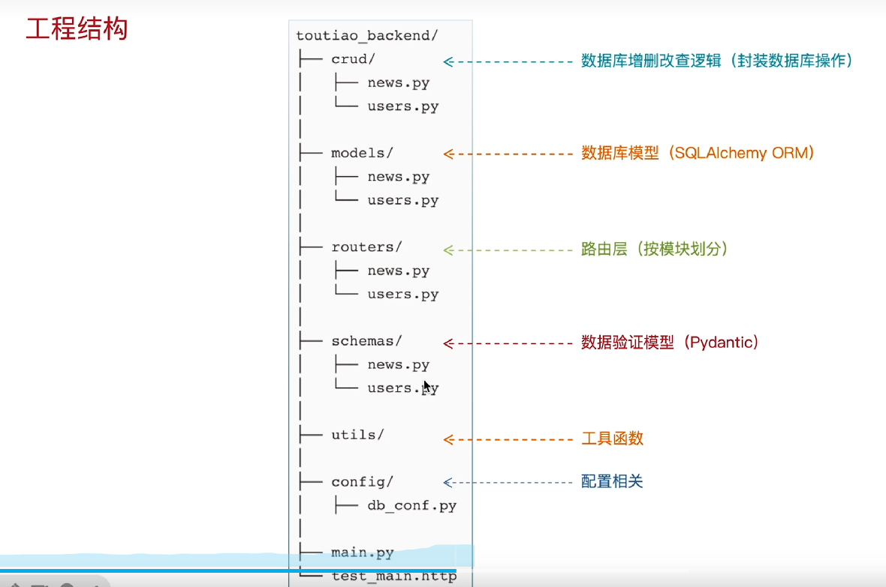
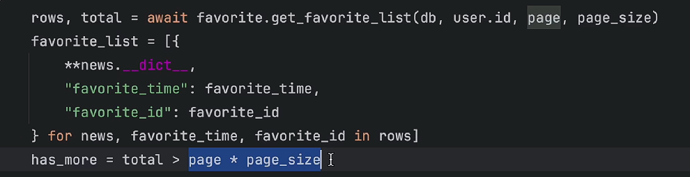

项目结构  
路由的实现：1.创建模块化目录---routers 在该目录下创建路由py文件  
2.在创建的路由py文件中导入APIRouter，使用APIRouter创建APIRouter实例 ----router = APIRouter(prefix="/api/news", tags=["news"])  
3.在main.py中使用fastApi实例使用include_router进行挂载

接口的实现：1.模块化路由 2.定义模型类 -> 数据库表
3.在crud目录下创建文件，封装操作数据库方法   4.在路由处理函数中调crud封装好的方法，响应结果
注意:使用depends依赖注入时，只在 FastAPI 路由解析时生效，普通函数调用不会注入。所以我们需要直接在路由层的函数进行依赖注入

解决跨域问题：后端引入cors中间件

更新语句:  update().where().values(字段=值)        
创建ORM对象,定义字段时,如    nickname: Mapped[Optional[str]] = mapped_column(String(50), nullable=True, comment="昵称")
这里的optional代表了该字段可以为空,如果没有optional的话,则该字段不能为空

安装passlibyil    pip install passlib[bcrypt]==1.7.4   pip uninstall passlib

注意: 1. **被 `Depends(xxx)` 引用的函数：可以写 Header、Query、Body、Depends，由 FastAPI 框架自动递归解析注入**。
2. 普通函数、手动直接调用的函数：这些注解只是普通对象，框架不会介入，不会自动注入。
success_response(UserInfoRequest.model_validate(user), "更新用户信息成功")中model_validate的作用:
作用：把外部对象（ORM 实例、dict）解析、校验，转换成当前 Pydantic 模型类的实例，只有继承了 `pydantic.BaseModel` 的类，才拥有 `model_validate` 这个类方法**。

连表查询: select(查询主题模型, 字段别名).join(联合查询的模型类, 联合查询的条件).where().order_by().offset().limit()
例如:select(News, Favorite.created_at.label("favorite_time"), Favorite.id.label("favorite_id"))
     .join(Favorite, Favorite.news_id == News.id)
     .where(Favorite.user_id == user.id)
     .order_by(Favorite.created_at.desc())
     .offset(((page-1) * page_size))
     .limit(page_size)
列表推导式和解包组包的用法: 

安装redis    pip install redis

jsonable_encoder(result_list)  #将ORM对象转换为Python原生的可序列化对象
news_data = [NewsItemBase.model_validate(item).model_dump(mode="json", by_alias=False) for item in result_list]
上行代码也是将ORM对象转换为Python原生的可序列化对象，model_validate将ORM对象转换为Pydantic模型类实例，model_dump将Pydantic模型类实例转换为Python原生的可序列化对象
